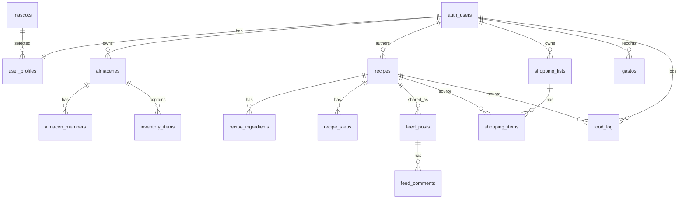

# FoodOS data model v0.1

Este modelo convierte el mock local de `fooOSappweb` en una base lista para Supabase/PostgreSQL. Parte del PDF tecnico y lo ajusta a lo que ya existe en la app: inventario, recetas, carrito, feed, finanzas, nutricion, asistente y mascotas.

## Principios

- Cada tabla de usuario lleva `user_id` u ownership indirecto para activar RLS.
- Los almacenes pueden ser personales o compartidos mediante `almacen_members`.
- El carrito se modela como lista (`shopping_lists`) + items (`shopping_items`) para soportar multiples tiendas.
- Las recetas separan metadata, ingredientes y pasos.
- El feed usa recetas como fuente, pero permite posts con texto propio.
- Nutricion separa perfil fisico, objetivos diarios y comidas registradas.
- Las llamadas IA y busquedas se guardan para cache, trazabilidad y control de coste.

## Entidades principales

### Usuario

- `user_profiles`: datos de perfil, objetivos corporales, alergias, banco activo y `mascot_id`.
- `mascots`: catalogo de 15 personajes del PDF.

### Inventario

- `almacenes`: Nevera, Congelador, Despensa y custom.
- `almacen_members`: usuarios miembros de cada almacen.
- `inventory_items`: alimentos, cantidades, macros, caducidad, precio estimado y origen externo.

### Recetas

- `recipes`: receta principal, publica/privada, imagen/video, macros, coste.
- `recipe_ingredients`: ingredientes con cantidad y macros por 100.
- `recipe_steps`: pasos ordenados para el modal de detalle.
- `recipe_saves`: recetas guardadas por usuario.
- `recipe_likes`: likes de recetas publicas.

### Carrito

- `shopping_lists`: lista por tienda o uso.
- `shopping_items`: items comprables, checked, precio estimado y origen receta.

### Feed

- `feed_posts`: publicacion social asociada opcionalmente a receta.
- `feed_post_likes`: likes por usuario.
- `feed_comments`: comentarios por post.

### Finanzas

- `gastos`: movimientos de gasto/ingreso manuales, banco, ticket, carrito.
- `ingresos_fuentes`: fuentes recurrentes.
- `objetivos_ahorro`: metas financieras.
- `bank_connections`: IDs de Nordigen/GoCardless, nunca credenciales bancarias.

### Nutricion

- `nutrition_goals`: objetivos diarios versionables.
- `food_log`: comidas registradas desde receta, inventario, barcode o manual.

### IA e integraciones

- `ingredient_searches`: historial de busqueda de recetas.
- `ai_recipe_cache`: cache de recetas IA por contexto.
- `ai_events`: auditoria ligera de acciones IA mock/reales.
- `notification_events`: alertas de caducidad, presupuesto, macros o banco.

## Relaciones clave

## Mapeo desde el mock actual

| Mock `localStorage` | Tabla real |
| --- | --- |
| `inventory[]` | `inventory_items` + `almacenes` |
| `cart[]` | `shopping_lists` + `shopping_items` |
| `expenses[]` | `gastos` |
| `feedPosts[]` | `feed_posts`, `feed_comments`, `feed_post_likes` |
| `consumed` | calculado desde `food_log` |
| `consumedMeals[]` | `food_log` |
| `nutrition` | `nutrition_goals` + `user_profiles` |
| `weeklyBudget` | `user_profiles.weekly_food_budget` |
| `mascotId` | `user_profiles.mascot_id` |
| `recipes[]` hardcoded | `recipes`, `recipe_ingredients`, `recipe_steps` |

## Pendiente antes de crear Supabase

- Confirmar nombres: mantener castellano (`almacenes`, `gastos`) o pasar todo a ingles. El SQL inicial mantiene los nombres del PDF donde ya existian.
- Decidir si las recetas demo iniciales seran seed global de sistema o creadas por un usuario demo.
- Decidir si `inventory_items` necesita categorias propias o solo `storage/type`. El esquema incluye `category`.
- Decidir si el feed admite posts sin receta. El esquema lo permite.

